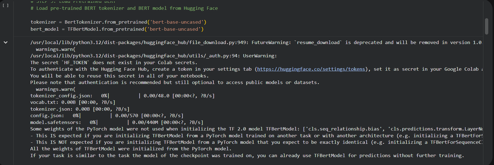
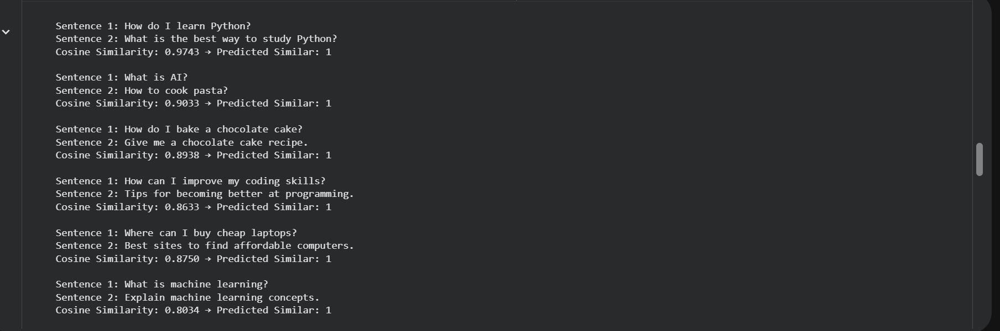
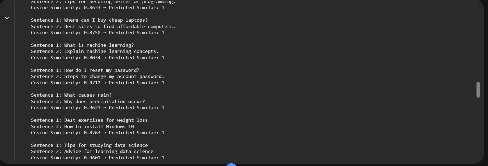
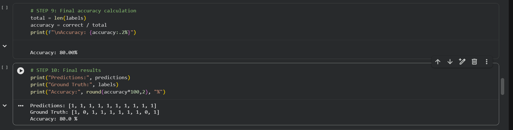

# Natural_language_processing_with_transformers
# Semantic Sentence Similarity with BERT
This project demonstrates how transformer-based language models (BERT) can be used to measure semantic similarity between sentences. It encodes sentences using a pre-trained BERT model from Hugging Face Transformers and compares their embeddings using cosine similarity to determine whether two sentences convey similar meaning.
The project highlights a practical application of modern NLP techniques for semantic analysis tasks such as duplicate detection, semantic search, and intent matching.


## Project Overview

Given two input sentences, the system:
- Generates contextual embeddings using a pre-trained BERT model
- Computes similarity between embeddings using cosine similarity
- Classifies sentence pairs as **Similar** or **Not Similar** based on a threshold

---

## Example Output
Sentence 1: How do I learn Python?
Sentence 2: What is the best way to study Python?

Cosine Similarity: 0.89
Predicted Similarity: Similar


---

## How It Works

1. Sentences are tokenized using the BERT tokenizer  
2. Tokenized inputs are passed through a pre-trained BERT encoder  
3. The `[CLS]` token embedding is extracted as the sentence representation  
4. Cosine similarity is computed between sentence embeddings  
5. A threshold is applied to determine similarity:
similarity > 0.7 → Similar
similarity ≤ 0.7 → Not Similar


---

## ✨ Features

- Uses pre-trained BERT model from Hugging Face Transformers
- Generates contextual sentence embeddings
- Computes semantic similarity using cosine similarity
- Simple threshold-based classification system
- Supports custom sentence input for testing
- Visual outputs and result analysis via Jupyter Notebook

---

## 🛠 Tech Stack

- Python  
- Hugging Face Transformers  
- TensorFlow  
- NumPy  
- Scikit-learn  
- Google Colab / Jupyter Notebook  

---

## Screenshots

### BERT Model Loading


### Sentence Similarity Results



### Final Model Accuracy


---
## Key NLP Concepts
# 1. Contextual Embeddings
Unlike traditional methods such as TF-IDF or Bag-of-Words, BERT generates embeddings based on the context of words within a sentence. This allows for a deeper semantic understanding.

# 2. Cosine Similarity
Cosine similarity measures the angle between two embedding vectors in high-dimensional space. It is widely used in NLP tasks such as semantic search, clustering, and duplicate detection.

## Limitations
- Performance depends on the pre-trained BERT model quality
- Threshold (0.7) is heuristic and not learned from data
- Computationally expensive compared to traditional models
- Not fine-tuned on a dedicated semantic similarity dataset
  
## Future Improvements
- Fine-tune on semantic textual similarity datasets (e.g., STS-B)
- Experiment with mean pooling instead of [CLS] token
- Build a REST API using FastAPI or Flask
- Create a simple web UI for interactive testing
- Optimize inference speed for larger datasets
  
## Real-World Applications
- Semantic search engines
- Duplicate question detection systems
- Chatbot intent matching
- Document clustering and classification

## How to Run the Project
- Open the notebook in Google Colab
- Run all cells sequentially
- Install dependencies if prompted:

```bash
pip install transformers
pip install tensorflow
pip install scikit-learn


